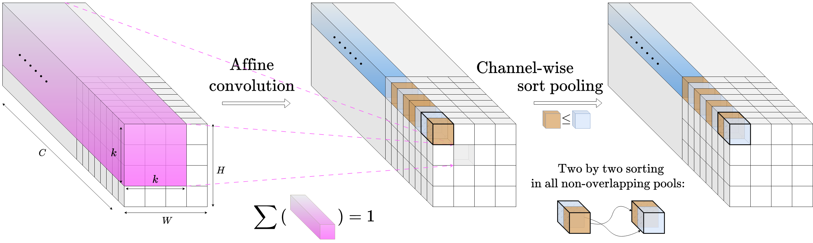
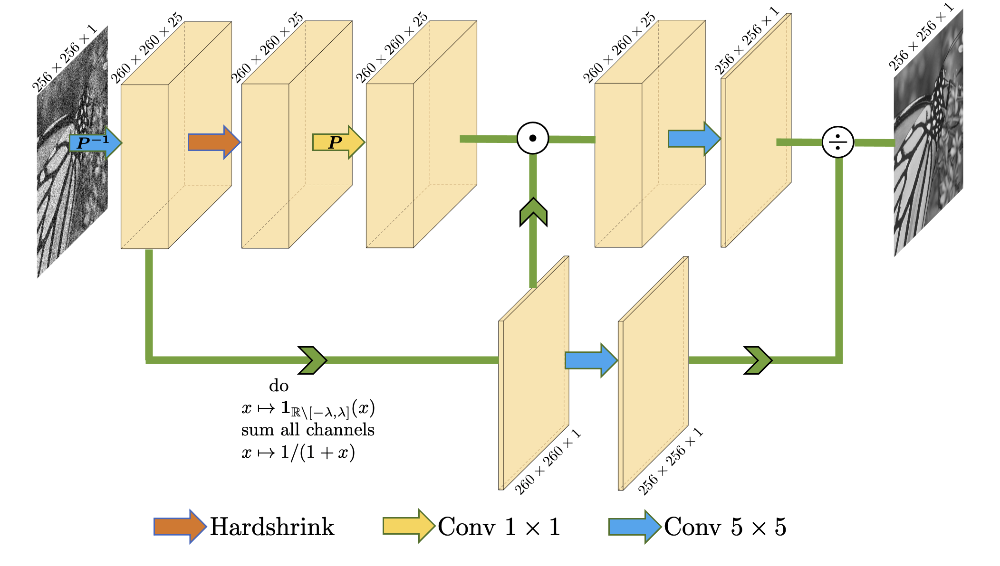
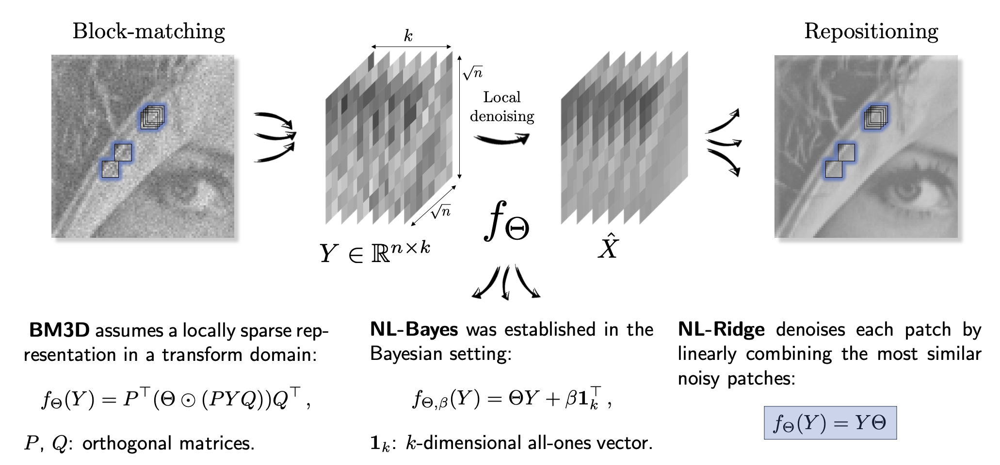

## Normalization-equivariant neural networks

We propose a methodology for adapting existing neural networks so that normalization-equivariance, a property which ensures that any change of the input image, whether by shifting or scaling, results in a corresponding change in the system response, holds by design.

   
 

 

  Illustration of the proposed normalization-equivariant alternative for replacing the traditional scheme “convolution + element-wise activation function” in CNNs: affine convolutions supersede ordinary ones by restricting the coefficients of each kernel to sum to one and the proposed sort pooling patterns introduce nonlinearities by sorting two by two the pre-activated neurons along the channels.

Publication: [here](https://papers.nips.cc/paper_files/paper/2023/hash/12143893d9d37c3569dda800b95cabd9-Abstract-Conference.html). 
Code: [here](https://github.com/sherbret/normalization_equivariant_nn).

## DCT2net

Focusing specifically on the popular DCT (Discrete Cosine Transform) denoiser, we show that it can be seen as a shallow CNN with weights corresponding to the DCT projection kernel and a hard shrinkage function as activation function. By training this particular CNN on an external dataset, we can refine the resulting transform and improve considerably its performance.

   
 

 
 
    Architecture of DCT2net for patches of size 5×5. 

Publication: [here](https://arxiv.org/abs/2107.14803). 
Code: [here](https://github.com/sherbret/DCT2net).

## NL-Ridge

We propose a unified view of unsupervised non-local methods for image denoising based on quadratic risk minimization. Under this paradigm, we build a novel denoiser called NL-Ridge which leverages linear combinations of patches. 

   
 

 
 
    llustration of the parametric view of several popular non-local denoisers. Examples of parameterized functions unequivocally identifying the denoiser are given, whose optimal parameters are eventually selected for each group of patches by “internal adaptation” optimization. 

Publication: [here](https://arxiv.org/abs/2203.00570). / Code: [here](https://github.com/sherbret/NL-Ridge).

## LIChI

LIChI is the multi-stage extension of NL-Ridge developed subsequently, achieving state-of-the-art performance in unsupervised image denoising.

Publication: [here](https://arxiv.org/abs/2212.00422). / Code: [here](https://github.com/sherbret/LIChI).

